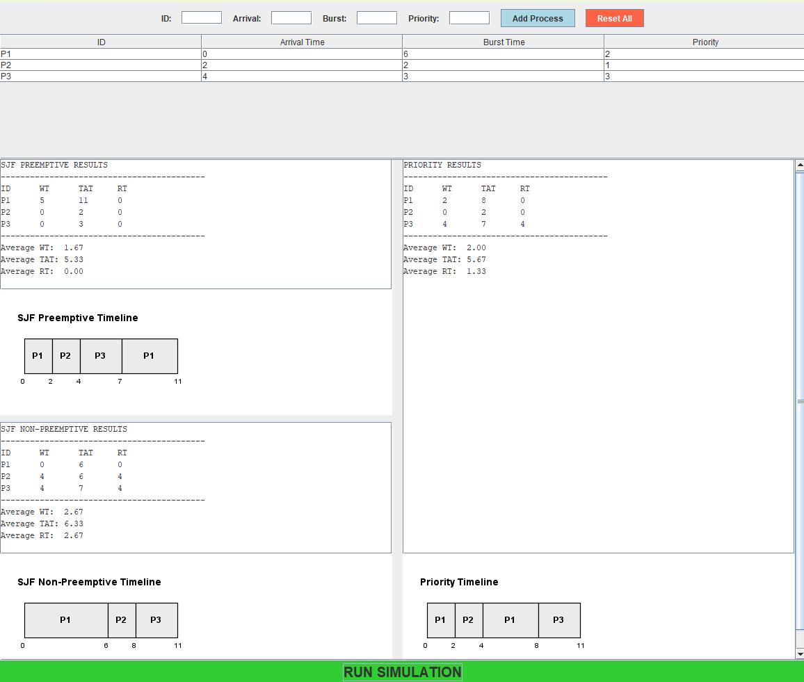
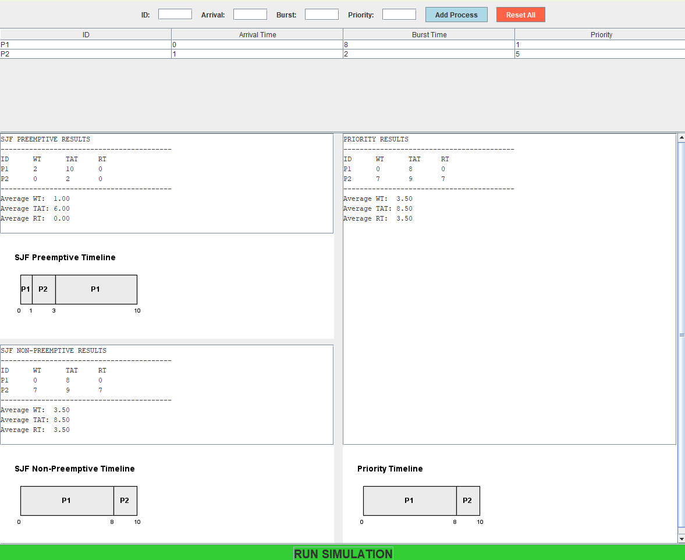
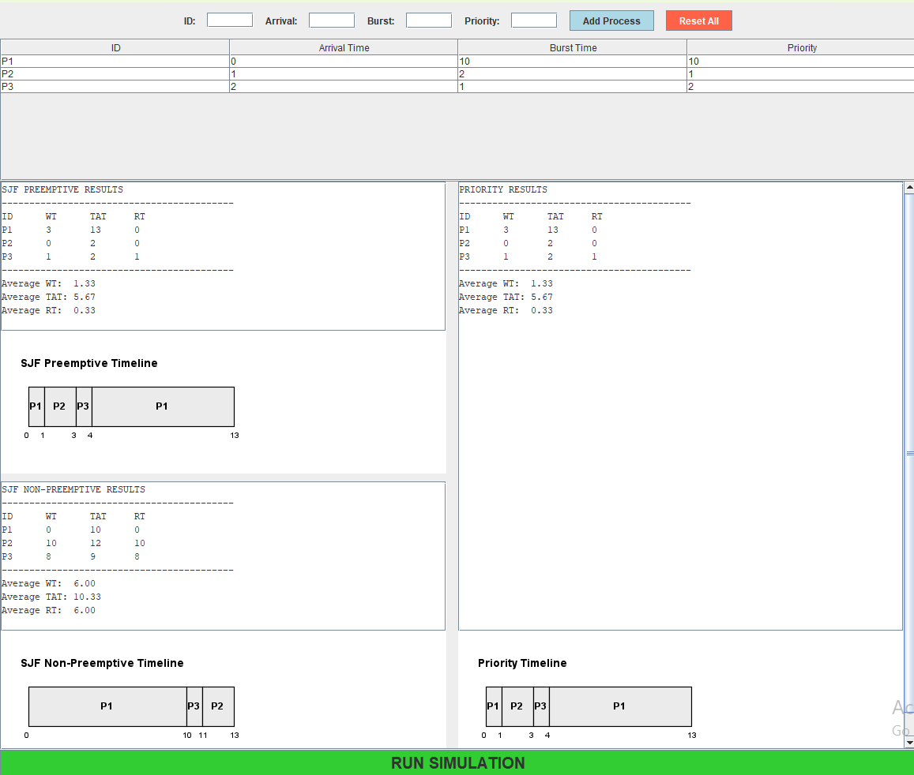
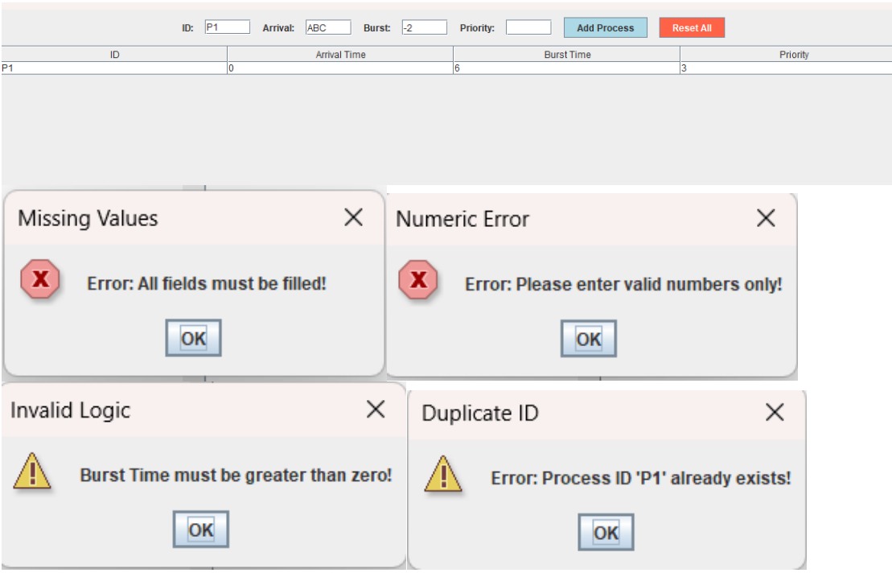

# 🚀 CPU Scheduling Simulator (SJF & Priority)

## 📝 Project Description
This project is a **Java-based simulator** designed to visualize and compare CPU scheduling algorithms. It provides a graphical user interface (GUI) to display calculation metrics and a real-time Gantt Chart.

### Supported Algorithms:
- **Shortest Job First (SJF):** Preemptive (SRTF) and Non-Preemptive.
- **Priority Scheduling:** Preemptive algorithm (Lower value = Higher priority).

---

## 👥 Team Members
| Name | Student ID |
| :--- | :--- |
| **محمد صلاح محمدي محمد** | 20240839 |
| **محمد احمد محمد محمد** | 20240792 |
| **مصطفي علي مصطفي علي** | 20240969 |

---

## 📊 Detailed Comparison & Analysis
*Derived from our simulation results and comparative study.*

### 1. Algorithms Logic & Assumptions
- **Priority Definition:** We follow the **Lower Value = Higher Priority** rule.
- **Tie-Breaking Rule:** If two processes have the same burst time or priority, **FCFS** (First-Come-First-Served) is used based on Arrival Time.
- **Preemption Logic:**
  - **Priority (Preemptive):** Current process is interrupted if a new process with higher priority arrives.
  - **SJF (SRTF):** Current process is interrupted if a new process has a shorter remaining burst time.
- **Input Validation:** The system rejects negative values, non-numeric data, and duplicate IDs to ensure stability.

### 2. Test Scenarios & Results
| Scenario | Description & Objective | Visualization |
| :--- | :--- | :--- |
| **Scenario A** | **Basic Mixed Workload:** Confirms the logic where SJF Preemptive interrupts for shorter jobs while Priority focuses on status. |  |
| **Scenario B** | **Conflict (Burst vs Priority):** Reveals the trade-off between urgent long jobs (Priority) and short non-urgent jobs (SJF). |  |
| **Scenario C** | **Fairness & Starvation:** Demonstrates how long jobs in SJF and low-priority jobs in Priority scheduling suffer delays. |  |
| **Scenario D** | **Input Validation:** Shows the simulator's ability to handle invalid data (negative numbers, empty fields) effectively. |  |

### 3. Analysis Summary
- **Efficiency:** **SJF Preemptive (SRTF)** performed best in minimizing average Waiting and Turnaround times.
- **Starvation:** Observed in "long jobs" (SJF) and "low-priority jobs" (Priority).
- **Fairness:** **SJF Non-Preemptive** is slightly fairer as it prevents repeated interruptions once a job secures the CPU.
- **Recommendation:** Use **SJF** for general-purpose efficiency and **Priority** for critical/real-time systems.

---

## 🛠️ Build and Run Steps

### Prerequisites
- **JDK:** Version 17 or higher.
- **Library:** Standard Java Swing & AWT (Included in JDK).

### Execution Steps
1. **Using an IDE:** - Open the project root.
   - Run `src/gui/MainDashboard.java`.
2. **Using Command Line:**
   ```bash
   # Compile
   javac -d out src/model/*.java src/scheduler/*.java src/gui/*.java
   
   # Run
   java -cp out gui.MainDashboard
